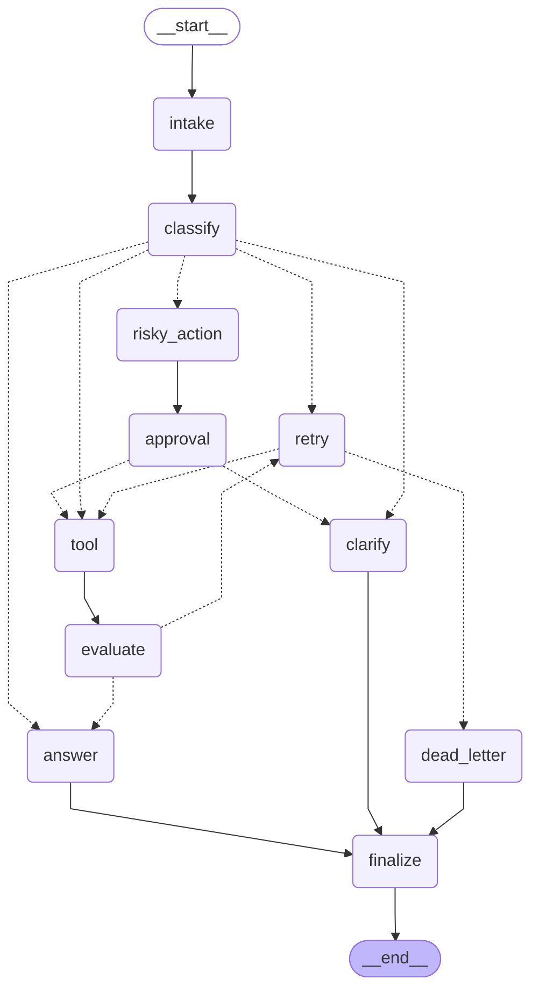

# Day 08 Lab Report

## 1. Team / student

- Name: Nguyễn Chí Hướng
- Repo/commit: Track3-DAY23-NguyenChiHuong-2A202601203 / final submission HEAD
- Date: 2026-08-25

## 2. Architecture

The workflow is an 11-node LangGraph state machine. `intake` normalizes the request and
`classify` uses Gemini structured output to select `simple`, `tool`, `missing_info`, `risky`, or
`error`. Conditional edges send read-only requests through tool evaluation, incomplete requests
to clarification, risky actions through approval, and failures through a bounded retry loop.
Every terminal route passes through `finalize` before `END`.

The following Mermaid diagram is generated from `build_graph().get_graph().draw_mermaid()`:



## 3. State schema

Scalar fields use overwrite semantics, while audit/history collections use the `add` reducer.

| Field | Reducer | Purpose |
|---|---|---|
| `route`, `risk_level` | overwrite | Current classification and risk level |
| `attempt`, `max_attempts` | overwrite | Bound the retry loop |
| `evaluation_result` | overwrite | Gate evaluation to answer or retry |
| `pending_question` | overwrite | Store the current clarification request |
| `proposed_action`, `approval` | overwrite | Control the human-approval path |
| `final_answer` | overwrite | Store the terminal user-facing response |
| `messages`, `tool_results` | append | Preserve conversation and tool history |
| `errors`, `events` | append | Preserve failures and audit events |

## 4. Metrics summary

| Metric | Value |
|---|---:|
| Total scenarios | 7 |
| Success rate | 100.00% |
| Average nodes visited | 6.43 |
| Total retries | 3 |
| Total approval events | 2 |
| Recovery evidence observed | Yes |

## 5. Scenario results

| Scenario | Expected route | Actual route | Success | Retries | Approval events | Approval observed | Latency (ms) |
|---|---|---|---:|---:|---:|---:|---:|
| S01_simple | simple | simple | Yes | 0 | 0 | No | 0 |
| S02_tool | tool | tool | Yes | 0 | 0 | No | 0 |
| S03_missing | missing_info | missing_info | Yes | 0 | 0 | No | 0 |
| S04_risky | risky | risky | Yes | 0 | 1 | Yes | 0 |
| S05_error | error | error | Yes | 2 | 0 | No | 0 |
| S06_delete | risky | risky | Yes | 0 | 1 | Yes | 0 |
| S07_dead_letter | error | error | Yes | 1 | 0 | No | 0 |

## 6. Failure analysis

1. **Transient or persistent tool failure:** Error results are evaluated as `needs_retry`. The
   retry node increments `attempt`, and routing sends the request back to the tool only while
   `attempt < max_attempts`. Exhausted requests go to `dead_letter`, preventing infinite loops.
2. **Risky action without approval:** Risky requests are prepared but cannot reach the mock tool
   before the approval node. A rejected decision routes to clarification; the tool also performs a
   defensive approval check and returns an error if invoked without approval.
3. **Ungrounded model response:** The answer prompt limits Gemini to the request, tool results,
   proposed action, and approval decision, and instructs it not to invent unavailable details.

## 7. Persistence / recovery evidence

The SQLite checkpointer uses a durable database connection with WAL mode. Each scenario receives a
unique `thread_id`; state history can be queried by that identifier and reopened from the same
database. Successful checkpoint state-history/recovery evidence was observed during the run.

Verification evidence from the final local run:

```text
uv run pytest tests/test_persistence.py -q
...                                                                      [100%]
3 passed

uv run python -m langgraph_agent_lab.cli validate-metrics --metrics outputs/metrics.json
Metrics valid. success_rate=100.00%
```

## 8. Extension work

- SQLite persistence with WAL and a reopen/recovery test.
- Optional real human-in-the-loop execution through `interrupt()` when
  `LANGGRAPH_INTERRUPT=true`; deterministic mock approval remains the default for CI.
- Append-only normalized events support route tracing and metrics.

## 9. Improvement plan

The first production improvement would replace mock tools with authenticated, idempotent service
adapters. Next priorities are distributed tracing, measured node latency, model-evaluation sets,
approval authorization, timeout/circuit-breaker policies, and production database lifecycle
management.

## 10. Final quality evidence

```text
uv run pytest -q
.....................................................                    [100%]
53 passed

uv run ruff check src tests
All checks passed!

uv run mypy src
Success: no issues found in 11 source files
```
